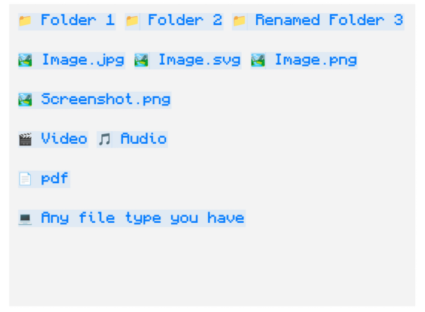
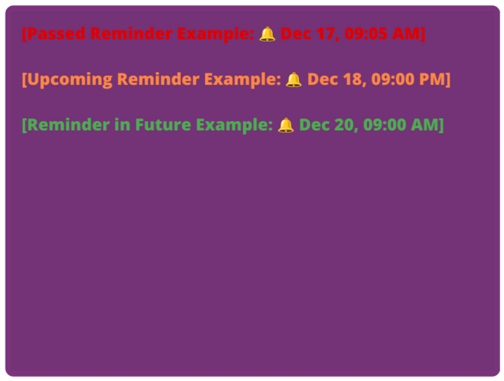
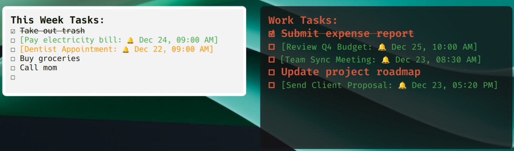
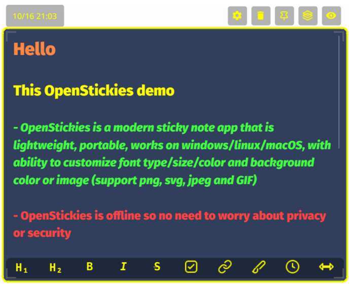
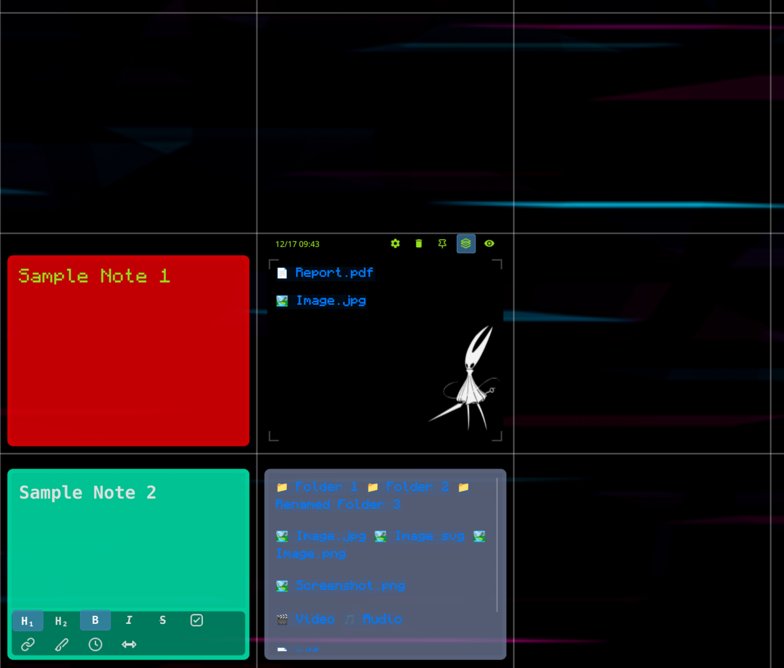
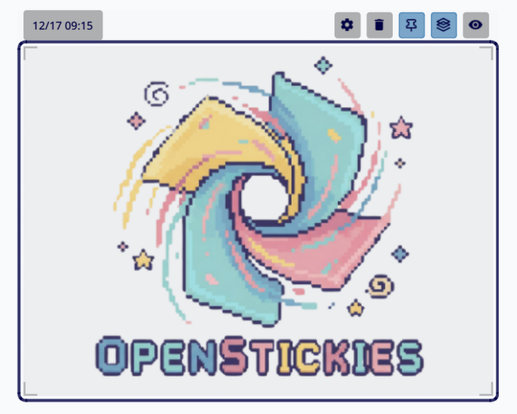
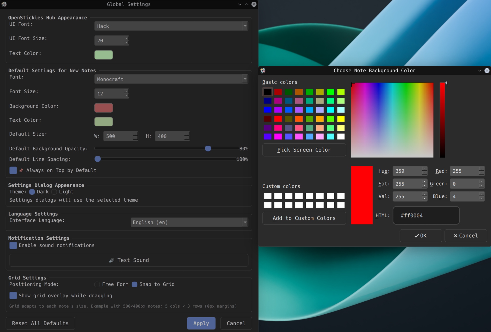

# OpenStickies Free

  
  
  

**Stick Anything to Your Desktop** — text notes, files, folders, screenshots, reminders, and more!

OpenStickies helps you stay focused with always-visible desktop notes. Perfect for ADHD brains needing visual anchors, quick task lists you'll delete when done, file shortcuts to avoid folder hunting, and decorating your desktop with functional beauty.

  

---

## Download

| Platform | File | Requirements |
|----------|------|--------------|
| **Windows** | `OpenStickies-Free-v2.5.0.exe` | Windows 10+ |
| **Linux** | `OpenStickies-Free-v2.5.0.AppImage` | Most distros (Ubuntu, Fedora, Arch, etc.) |
| **macOS** | Coming soon | — |

👉 **[Download Latest Release](https://github.com/032659/OpenStickies/releases/latest)**

---

## Free vs Premium

| Feature | Free | Premium |
|---------|------|---------|
| Notes | 5 max | Unlimited |
| Reminders | 1 | Unlimited |
| GIF Backgrounds | 1 | Unlimited |
| All other features | ✅ | ✅ |
| Updates | ✅ | ✅ (earlier access) |

**Want unlimited?** Get Premium at [openstickies.com](https://openstickies.com) — one-time purchase, yours forever.

---

## Features

### 📎 Paste Anything
Drag files, folders, or paste screenshots directly into notes. 70+ file types supported with automatic icons.

  

### 🔔 Smart Reminders
Color-coded notifications that live in your notes — green for upcoming, orange for due soon, red for overdue.

  

### ✅ Tasks & Checkboxes
Interactive todo lists with auto-strikethrough when completed.

  

### 🎨 Rich Text & Customization
Bold, italic, headings, hyperlinks, custom backgrounds (images & GIFs), and more.

  

### 📐 Snap to Grid & Pin
Perfectly aligned layouts with snap-to-grid. Pin notes to lock position and content.

  
  

### 🖼️ Desktop Decoration
Make your workspace beautiful and functional.

  

---

## More Features

- **🔝 Always on Top** — Keep notes visible above other windows
- **💾 Auto-Save** — Your notes are always saved automatically
- **🌍 12 Languages** — English, Arabic (RTL), Chinese, German, Spanish, French, Hindi, Indonesian, Japanese, Korean, Portuguese, Russian
- **🖥️ Multi-Monitor** — Works across all your screens

---

## Updates

Check for new releases:
- **This repo**: [Releases page](https://github.com/032659/OpenStickies/releases)
- **Website**: [openstickies.com](https://openstickies.com)

---

## Support

- **Website**: [openstickies.com](https://openstickies.com)
- **Discord**: [Join community](https://discord.gg/8gGZSUJjZd)
- **Reddit**: [r/OpenStickies](https://www.reddit.com/r/OpenStickies/)
- **Email**: support@openstickies.com

---

## License

OpenStickies is proprietary software. Free version includes all core features with usage limits. See [openstickies.com](https://openstickies.com) for full terms.

---

  Built with ❤️ for people who struggle with focus

