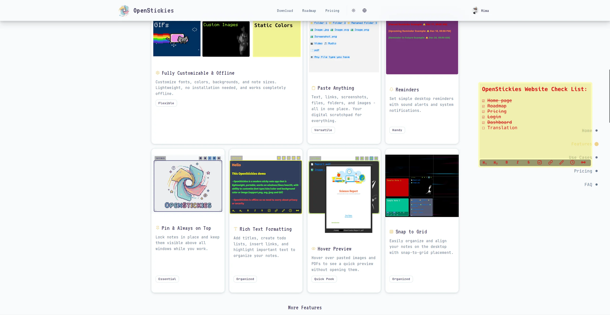
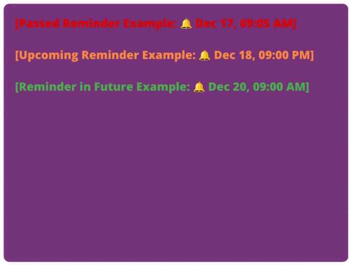
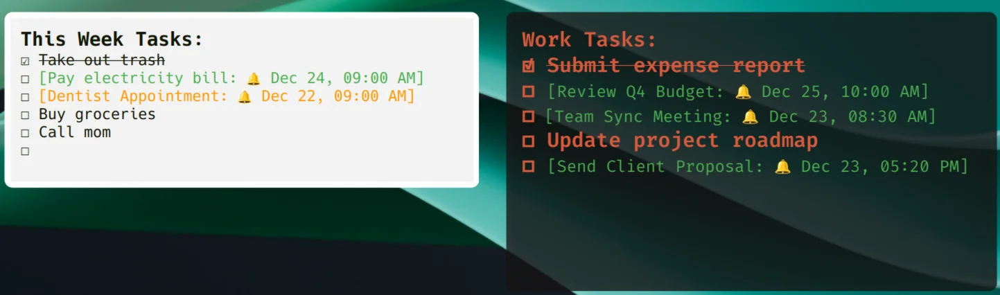
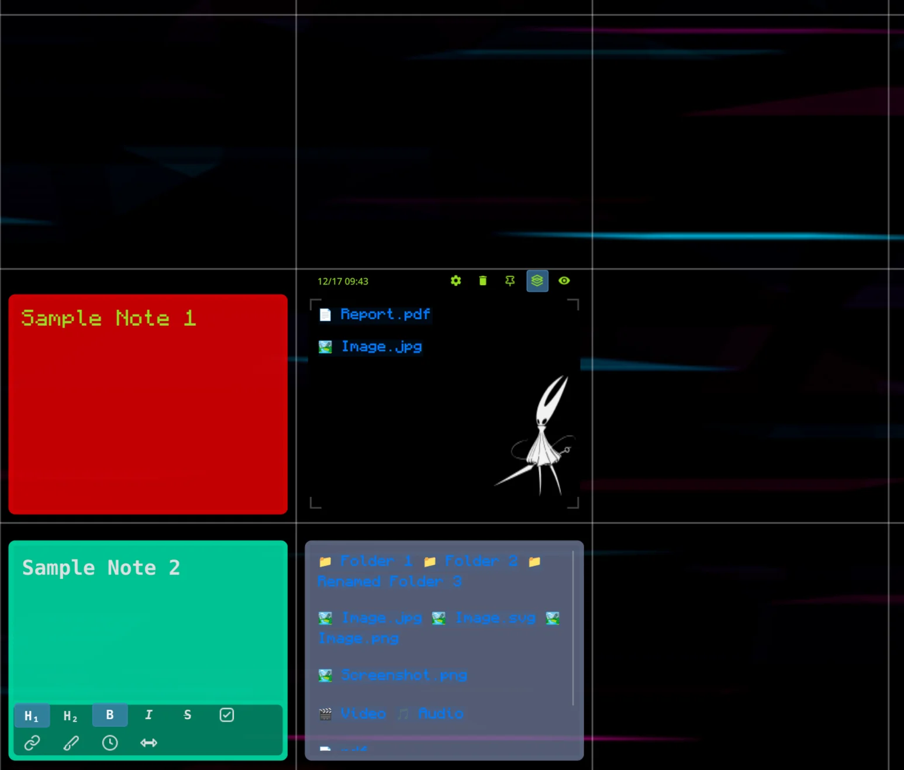

# OpenStickies

A sticky notes app for Windows and Linux. Drop files, paste screenshots, set reminders, keep stuff visible on your desktop.

  

<p align="center">
  
</p>

## Download

**[Get the latest release](https://github.com/HimaSphere/OpenStickies/releases/latest)**

| Platform | File | Notes |
|----------|------|-------|
| Windows | `.exe` | Windows 10+ |
| Linux | `.AppImage` | Works on most distros |
| macOS | — | Coming soon |

Download, run, done. No installer needed for AppImage (just make it executable).

## Free vs Premium

The free version does everything, just with limits:

| | Free | Premium |
|-|------|---------|
| Notes | 5 | Unlimited |
| Reminders | 1 | Unlimited |
| GIF backgrounds | 1 | Unlimited |

Premium is a one-time purchase at [openstickies.com/pricing](https://openstickies.com/pricing).

## Features

**Paste anything** — Files, folders, screenshots. Drag stuff in, it becomes a clickable shortcut. 70+ file types supported.

<p align="center">
  
</p>

**Reminders** — Set them right in the note. Color changes based on urgency (green → orange → red).

<p align="center">
  
</p>

**Checkboxes** — Click to check, text gets strikethrough.

<p align="center">
  
</p>

**Formatting** — Bold, italic, headings, links, custom backgrounds (images and GIFs).

<p align="center">
  
</p>

**Grid snap + pinning** — Align notes to a grid. Pin to lock position and prevent edits.

<p align="center">
  
</p>

**Also:** always-on-top, auto-save, multi-monitor, 11 languages (including RTL Arabic).

## Troubleshooting

**Linux: AppImage won't run**
```bash
chmod +x OpenStickies*.AppImage
./OpenStickies*.AppImage
```

**Linux: Wayland issues**
```bash
QT_QPA_PLATFORM=xcb ./OpenStickies*.AppImage
```

**Windows: SmartScreen warning**
Click "More info" → "Run anyway". The app isn't signed yet.

**Reset everything**
Delete the config folder:
- Linux: `~/.config/OpenStickies/`
- Windows: `%APPDATA%\OpenStickies`

## Get help

- [Discord](https://discord.gg/8gGZSUJjZd)
- [r/OpenStickies](https://www.reddit.com/r/OpenStickies/)
- [Report bugs](https://github.com/HimaSphere/OpenStickies/issues)
- support@openstickies.com

## About

**OpenStickies** — sticky notes app for Windows and Linux

Built by [Hima](https://github.com/HimaSphere). Website: [openstickies.com](https://openstickies.com)

**Note:** OpenStickies is proprietary software. This repo is for free version releases only — no source code.
