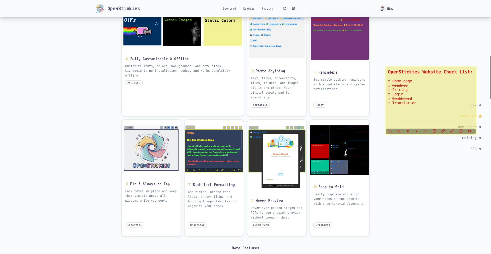
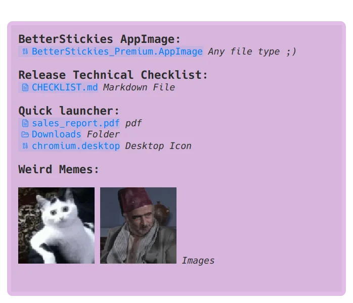
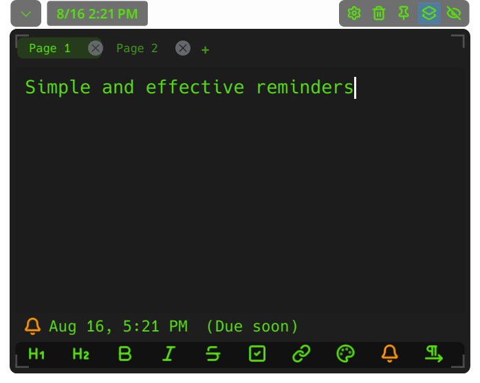
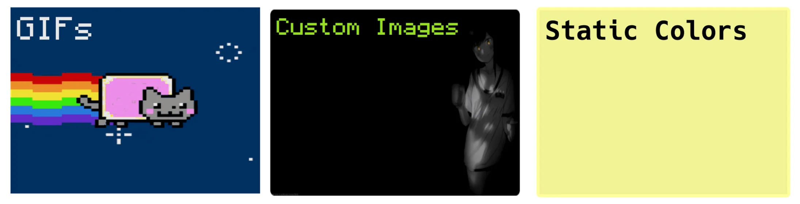
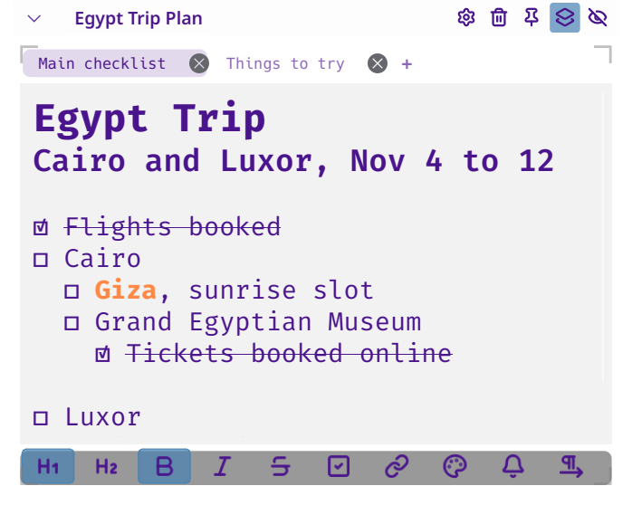
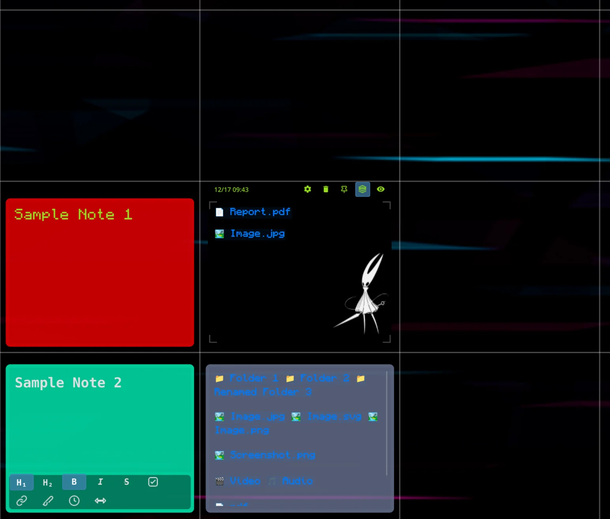
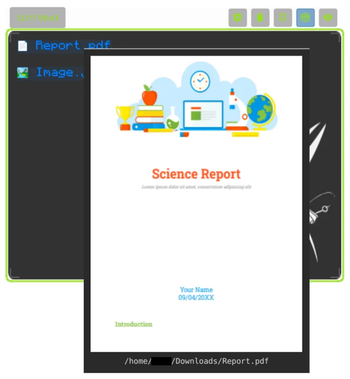

<div align="center">

# Better Stickies

**Stick anything to your desktop.**

Drop in files, paste screenshots, write code blocks, set reminders, and split a note into tabs. Fully offline, right where you work.

   [](https://buymeacoffee.com/betterstickies)
<br><br>

<br><br>
<a href="https://github.com/himasphere/betterstickies/releases/latest">
  
</a>
<br>

| Platform | File | Notes |
|----------|------|-------|
| Windows | `.exe` | Windows 10+ |
| Linux | `.AppImage` | Works on most distros |
| macOS | - | In development |

</div>

---

## Features

### Note tabs

A note is no longer a single sheet. Split it into up to 3 pages behind tabs, and search reads every page, even in hidden notes.

<!-- screenshot: images/note-tabs.webp -->

### Paste anything

Files, folders, screenshots. Drag it in, it becomes a clickable shortcut with a proper file-type icon.

<p align="center">
  
</p>

### Reminders

Set them right in the note. Color changes based on urgency: green, orange, red.

<p align="center">
  
</p>

### Custom backgrounds

Images, GIFs, solid colors. Make each note yours.

<p align="center">
  
</p>

### Rich text formatting

Bold, italic, headings, links, code blocks, and nested checklists with Tab and Shift+Tab.

<p align="center">
  
</p>

### Grid snap + pinning

Align notes to a grid. Pin to lock position and prevent edits.

<p align="center">
  
</p>

### Hover preview

Peek at note contents without opening them.

<p align="center">
  
</p>

### And more

- **Always-on-top**: keep notes above other windows
- **Auto-save**: never lose a note
- **Multi-monitor**: place notes across screens
- **Collapsible notes**: shrink a note to its title bar
- **Image lightbox**: click a pasted image to view it full size
- **Export to JSON**: your notes are yours
- **12 languages**: including RTL Arabic
- **Fully offline**: no accounts, no cloud, no tracking

---

## Free vs Premium

The free version has one limit: **4 notes**. Extra note pages (tabs) share those 4 slots. Everything else works the same in both versions.

Premium unlocks **unlimited notes**, and tabs stop counting toward the limit. It is a one-time purchase: **pay once, use forever**.

<div align="center">

<a href="https://betterstickies.com/pricing"><strong>See pricing &rarr;</strong></a>

</div>

---

## Community

<div align="center">

[Discord](https://discord.gg/8gGZSUJjZd) · [r/BetterStickies](https://www.reddit.com/r/BetterStickies/) · [Report a bug](https://github.com/himasphere/betterstickies/issues) · support@betterstickies.com

If BetterStickies is useful to you, consider giving it a star, it helps others find it.

</div>

---

<details>
<summary><strong>Troubleshooting</strong></summary>

<br>

**Linux: AppImage won't run**
```bash
chmod +x BetterStickies*.AppImage
./BetterStickies*.AppImage
```

**Linux: Wayland issues**
```bash
QT_QPA_PLATFORM=xcb ./BetterStickies*.AppImage
```

**Windows: SmartScreen warning**

Click "More info" → "Run anyway". The app isn't signed yet.

**Reset everything**

Delete the config folder:
- Linux: `~/.config/BetterStickies/`
- Windows: `%APPDATA%\BetterStickies`

</details>

---

<div align="center">

Built by [Hima](https://github.com/himasphere) · [betterstickies.com](https://betterstickies.com)

Better Stickies was previously named **OpenStickies**. Releases v2.x below the 1.x line are from that era; version numbers restarted at 1.0.0 with the rename.

BetterStickies is proprietary software. This repo is for free version releases only, no source code.

</div>
